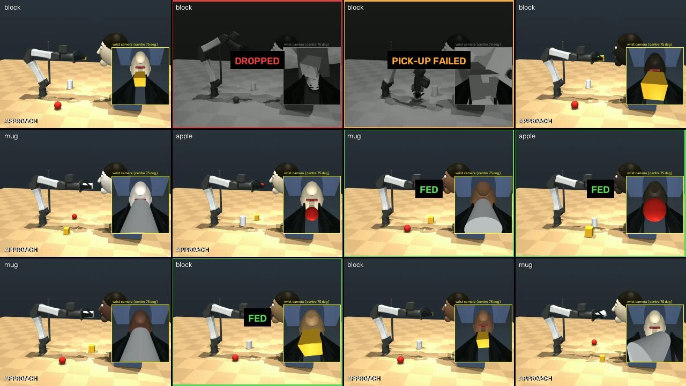
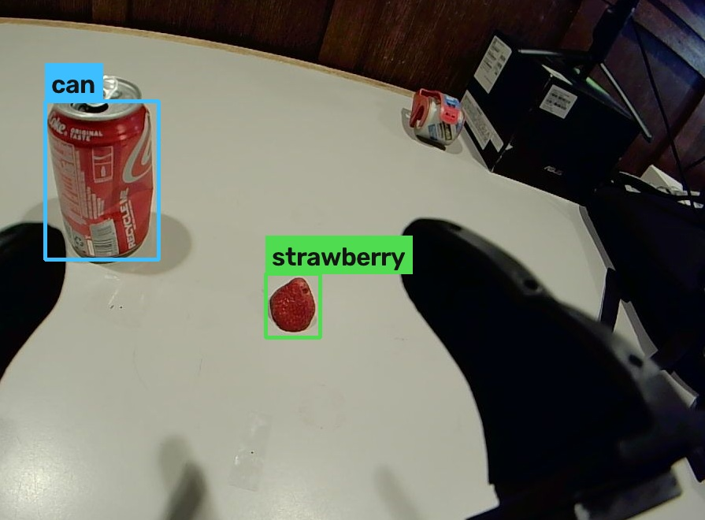

# Learning to feed with one camera — RL on the OpenYAM arm

A robot arm that picks up the food you ask for and brings it to your mouth, for people who cannot use
their arms. The reach and the grasp were **learned by reinforcement learning from a reward signal
alone**: no human demonstrations, no imitation learning, no teleoperation data. The policy's only
inputs are **one wrist camera and the motors' own feedback**. No depth sensor, no external camera.

<p align="center">
  
</p>

**Video:** [`demo/feeding_matrices_3x4.mp4`](demo/feeding_matrices_3x4.mp4) — three 3x4 grids of full
pick-up-and-feed runs, real time. Failed runs fade to grey. Single runs: [apple](demo/single_run_apple.mp4),
[mug](demo/single_run_mug.mp4), [block](demo/single_run_block.mp4).

## Results

Simulation (MuJoCo), with every simulator shortcut removed: the policy only knows what its wrist camera
has actually seen, "I have arrived" and "I have hold of it" are decided from camera and motor feedback
only, and the safety shield uses the last camera sighting of the person plus the arm's own kinematics.

| | |
|---|---|
| Reach success (training) | **96%** |
| Full pick-up and feed | **76%** — 121 of 160 runs |
| Unsafe arrivals at the head | **0** of 160 |
| Food dropped | 1 of 160 |
| Closing speed at the face | max 0.013 m/s (limit 0.03) |
| Training | ~22 million control steps overnight on one machine, 48 simulated arms in parallel (~200 h of arm time) |

Each run: a different food (apple / mug / block class, 35% of them at 45–60% size), a different head size
(±8%), a different skin tone (10 tones of the Monk scale), and a different food position.

## How it works

```
"strawberry"  ->  wrist camera finds it  ->  learned REACH  ->  learned PLACE + PINCH
              ->  scripted vertical LIFT  ->  scripted FEED: pull back, centre the face,
                  approach slowing as the face looms, stop on apparent face size
```

* **Learned** (PPO, Stable-Baselines3): reach, and place+pinch. 33-value observation, 7-value action, 30 Hz.
  Each stage is trained from the end state of the previous one, so the deployed chain matches training.
* **Scripted**: the lift (Cartesian, damped least squares) and the feed. The feed judges range from
  how *wide the face looks in degrees*, which is lens-independent; it never knows the person's head size.
* **Safety is in the reward.** Failure ranking, worst first: arriving at the head too fast; dropping the
  food; everything else. Touching the person ends the episode with the largest penalty (−200), and not
  picking up the food is the biggest task penalty (−40). A hard keep-out shield backs the arm away from
  the person at 3 cm/s if any learned or scripted action would carry it closer.
* **What the camera sees on the real arm:**

<p align="center">
  
</p>

The real perception layer (`../real/`) names the food in plain words: colour proposes candidates on the
table, a vision-language model decides between the foods on the menu, and MediaPipe gives the feed its
two inputs, mouth bearing and face width in degrees. The real-arm control backend (`../real/real_arm.py`)
adds gravity + friction feed-forward fitted to this arm, hold-never-drop on any fault, a torque stop that
backs off on contact, and a bounded squeeze so soft fruit is not crushed. It has held the real arm, run
the gripper, and moved the arm to the policy's start pose and back (peak lag 0.018 rad, no guard tripped).

## Lessons that cost the most

Every success counter in this project lied at least once. The policy learned to **swat** the food off
the table (24/25 "success"), to **hover** over it collecting reward without closing the jaws, and to
**park** at the object and collect rent. Each time the fix was the same: cap every per-step bonus so it
can never out-pay finishing, charge an early failure for the time it skipped, then *watch the behaviour*
before believing a number. The learned reach and grasp with a scripted lift is what came out of that,
and it is what runs. The full log is in [`../RL_HANDOFF.md`](../RL_HANDOFF.md).

## Run it

```bash
cd "$(git rev-parse --show-toplevel)"
python -m venv .venv-arm && .venv-arm/bin/pip install -r arm/rl/requirements.txt
git clone https://github.com/google-deepmind/mujoco_menagerie third_party/mujoco_menagerie
export YAM_MENAGERIE=$PWD/third_party/mujoco_menagerie PYTHONPATH=$PWD:$PWD/arm/rl OMP_NUM_THREADS=1

.venv-arm/bin/python -m pytest arm/rl/tests -q                                   # reward-shape tests
.venv-arm/bin/python arm/rl/scripts/hybrid_feed.py arm/rl/models/grasp_v2 40      # 40 full pick-and-feed runs
.venv-arm/bin/python arm/rl/scripts/record_feed.py                                # record videos
.venv-arm/bin/python arm/rl/scripts/run_resumable.py --config arm/rl/configs/feed.yaml --stage reach   # train
```

Trained policies: `models/grasp_v2/` (reach + fine-tuned place-and-pinch). Configs: `configs/feed.yaml`,
`configs/feed_pinch.yaml`. Environment: `hackmit_rl/envs/openyam_feed.py`. Recorded feed data: `data/`.
