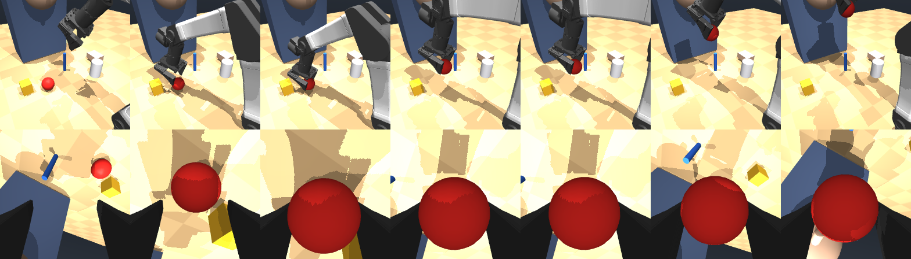

# yam_agentic

LLM-planned pick-and-deliver on the openYAM (I2RT YAM, 6-DoF + parallel gripper): ask for an
object in plain language, the arm picks it up and brings it somewhere that makes sense for that
object — an apple to your mouth, a mug to the table in front of you.

**Start here:** [HANDOFF.md](HANDOFF.md) — context, architecture, decisions, open questions.
Then [MEASUREMENTS.md](MEASUREMENTS.md) for the numbers and how they were produced, and
[GAME_PLAN.md](GAME_PLAN.md) for the research behind the plan.

Simulation only so far. Nothing in here has run on the physical arm.



*Scene camera on top, wrist camera below. Pick the apple, carry it, present it 15 cm from the
mouth — the arm stops there on purpose.*

## Setup

Needs Python 3.11+, `mujoco>=3.1.3`, `numpy`, `pytest`, and `imageio` for the filmstrips.

```bash
pip install "mujoco>=3.10" numpy pytest imageio

# the arm model lives in mujoco_menagerie, which is not vendored here
git clone --depth 1 https://github.com/google-deepmind/mujoco_menagerie
export YAM_MENAGERIE=$PWD/mujoco_menagerie
```

`YAM_MENAGERIE` can point at the menagerie root or directly at its `i2rt_yam` folder. Without
it, the code walks up from the source file looking for `mujoco_menagerie/i2rt_yam` and fails
with an actionable message if it cannot find one.

Generated scene MJCFs are written next to the arm model inside the menagerie checkout, with a
content hash in the filename so parallel workers never collide.

## Run it

```bash
pytest sim/test_yam_sim.py -q          # the phase-0 gate, 11 tests, ~1 s

python sim/demo_pick_present.py apple  # pick + present, writes a filmstrip to media/
python sim/demo_pick_present.py mug    # also: marker, block

python tools/measure_envelope.py       # re-derive the reach envelope (~15 s)
python tools/find_wrist_cam_mount.py   # re-derive an unoccluded wrist camera mount
```

## Layout

```
HANDOFF.md        context, architecture, decisions, assumptions, next steps
MEASUREMENTS.md   every number, with the script that produced it
GAME_PLAN.md      the research: what to build, what to skip, and why
sim/
  yam_scene.py          generated MJCF: arm + wrist cam + base-mounted scene cam + objects + user
  yam_ik.py             measured tool frame; damped-least-squares IK
  yam_expert.py         plans pick / carry / present as absolute joint targets
  test_yam_sim.py       the gate
  demo_pick_present.py  filmstrip demo
tools/
  measure_envelope.py       IK-verified reach envelope
  find_wrist_cam_mount.py   ray-cast search for a camera mount with line of sight
media/                  filmstrips and single-camera stills
```

## Knobs

Everything is an environment variable, following the convention in the team's SO-101 code.

| | |
|---|---|
| `YAM_MENAGERIE` | where mujoco_menagerie lives |
| `YAM_OBJECTS` | comma-separated subset of `apple,mug,marker,block` |
| `YAM_USER_X/Y/Z` | where the seated user is |
| `YAM_GRIP_KP` | gripper stiffness — **see the assumption note in HANDOFF.md § 8** |
| `YAM_CAM_RES`, `YAM_WRIST_FOVY`, `YAM_SCENE_FOVY` | cameras |
| `YAM_APPROACH`, `YAM_LIFT`, `YAM_SQUEEZE`, `YAM_STAGING` | planner distances |
| `YAM_SPEED`, `YAM_SLOW`, `YAM_DWELL`, `YAM_SETTLE` | trajectory timing |

## Two things to know before you change the planner

**Put objects at 0.25–0.45 m.** Top-down grasps reach 0.15–0.50 m; a *level* side grasp only
works beyond 0.65 m because the arm cannot fold back closer than that.

**`grasp_site` is not the tool centre point.** It sits 4.4 cm away from the point between the
pads and its z-axis is 19° off the tool axis. Use `ToolFrame`, which measures both off the model.
